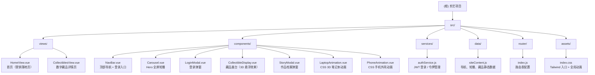

# 剪艺数字艺术平台 — 项目 AI 上下文

> 变更记录见文末。本文档由 AI 自动生成，勿手动修改结构标题。

---

## 项目愿景

**剪艺**（Jianyi）是一个以中国传统剪纸非遗艺术为核心主题的数字展示与电商平台。项目将传统窗花纹样与现代深色系高定审美相融合，提供：

- 沉浸式剪纸作品展示（数字藏品 / 限量发售）
- 品牌官网级营销落地页（Hero 轮播 + 工艺介绍 + 文创周边）
- 用户 JWT 登录认证流程

技术取向为单页面应用（SPA），依托 Devbox 云环境一键运行。

---

## 架构总览

| 层次 | 技术 | 说明 |
|------|------|------|
| 框架 | Vue 3 (Composition API) | 全局状态通过 `ref`/响应式管理 |
| 构建 | Vite 5 | 开发 HMR + 生产 preview 服务 |
| 路由 | vue-router 5 | History 模式，2 条路由 |
| 样式 | Tailwind CSS 3 + PostCSS | 自定义 Tailwind 主题色（`evasion-black`、`accent` 等），配合 `index.css` 全局动画 |
| 图标 | lucide-vue-next | 按需导入 |
| 认证 | JWT + localStorage | 与外部后端 API 通信 |
| 部署 | Devbox / Docker | `entrypoint.sh` 区分 dev / prod 两种启动模式 |

---

## 模块结构图



---

## 模块索引

| 路径 | 职责 | 关键文件 |
|------|------|----------|
| `src/views/` | 页面级路由组件 | `HomeView.vue`、`CollectiblesView.vue` |
| `src/components/` | 可复用 UI 组件 | 7 个组件，见下方组件文档 |
| `src/services/` | 认证服务层 | `authService.js` |
| `src/data/` | 静态内容数据 | `siteContent.js` |
| `src/router/` | 前端路由配置 | `index.js` |
| `src/assets/` | 图片、全局 CSS | `index.css`、窗花 PNG × 3 |

---

## 路由表

| 路径 | 名称 | 组件 | 说明 |
|------|------|------|------|
| `/` | `home` | `HomeView.vue` | 品牌营销首页 |
| `/collectibles` | `collectibles` | `CollectiblesView.vue` | 数字藏品展示页 |

---

## 运行与开发

```bash
# 开发模式（默认，含 HMR）
bash entrypoint.sh

# 生产模式（构建 + Vite preview）
bash entrypoint.sh production

# 或直接使用 npm
npm run dev        # 开发
npm run build      # 构建
npm run preview    # 预览
```

- 开发服务器监听 `0.0.0.0:3000`，支持热更新。
- 生产 preview 同样监听 `0.0.0.0:3000`。
- 路径别名：`@` → `src/`（在 `vite.config.js` 和 `jsconfig.json` 中均已配置）。

---

## 外部依赖与 API

| 服务 | URL | 说明 |
|------|-----|------|
| 登录 API | `https://bpsljpqucopd.sealosbja.site/api/auth/login` | POST，返回 JWT token |
| 用户注册站 | `https://nwiexwzoxsyb.sealosbja.site` | 无内嵌注册，跳转外链 |

**localStorage 键名：**
- `paper-cut-jwt-token` — JWT 令牌
- `paper-cut-username` — 已登录用户名

---

## 测试策略

当前项目**尚无测试文件**（无 `tests/`、`__tests__/`、`*.spec.*`）。

建议后续补充：
- 单元测试：Vitest + @vue/test-utils（组件行为、authService 逻辑）
- E2E 测试：Playwright（登录流程、路由跳转）

---

## 编码规范

- **组件**：使用 `<script setup>` Composition API 风格，Props 用 `defineProps`，事件用 `defineEmits`。
- **样式**：优先 Tailwind utility class；少量组件级样式用 `<style scoped>`；全局动画写在 `src/assets/index.css`。
- **字体**：全局使用楷体系（`STKaiti`/`KaiTi` 等宋楷族），与东方美学主题一致。
- **图标**：统一从 `lucide-vue-next` 按需导入，不引入整包。
- **颜色**：主色调为暗黑（`#121212`）+ 暗金（`#D2C4A7`）+ 暗玉紫；直接写 Tailwind 任意值或 CSS 变量。
- **路径**：使用 `@/` 别名引用 `src/` 下的所有资源。

---

## AI 使用指引

- 修改内容数据时，编辑 `src/data/siteContent.js`，无需改动组件。
- 新增路由页面：在 `src/views/` 创建 `.vue` 文件，并在 `src/router/index.js` 注册。
- 新增组件：放入 `src/components/`，遵循 `<script setup>` 风格。
- 认证逻辑集中于 `src/services/authService.js`，组件不直接操作 localStorage。
- Tailwind 自定义 token（`evasion-black`、`accent` 等）需检查是否在 `tailwind.config.js` 中定义（当前项目未检测到该文件，可能通过 CSS 变量或内联值实现）。

---

## 变更记录 (Changelog)

| 时间 | 操作 | 说明 |
|------|------|------|
| 2026-04-13T07:07:57+0000 | 初始化创建 | AI 全量扫描项目后首次生成，覆盖率 100%（20/20 源码文件） |
