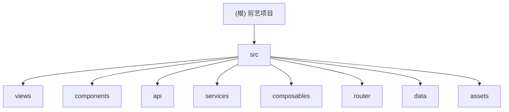

# 剪艺数字艺术平台 — 项目 AI 上下文

> 变更记录见文末。本文档由 AI 自动生成，勿手动修改结构标题。

---

## 项目愿景

**剪艺（Jianyi）** 是一个以中国传统剪纸非遗为核心的数字艺术展示平台，当前演进为包含「品牌首页 + 藏品展示 + 活动页 + 应用页 + 联系页 + 鉴权纹样库」的 Vue 3 单页应用。

核心目标：
- 用现代网页交互重构传统剪纸审美表达；
- 提供可扩展的数字内容展示与活动传播入口；
- 通过 JWT 鉴权保护部分数据能力（在线纹样库）。

---

## 架构总览

| 层次 | 技术 | 说明 |
|------|------|------|
| 前端框架 | Vue 3 (`<script setup>`) | 页面与组件全部采用 Composition API |
| 构建工具 | Vite 5 | `dev/build/preview` 三套脚本 |
| 路由 | vue-router 5 | 6 条页面路由，含鉴权守卫 |
| 样式系统 | Tailwind CSS 3 + PostCSS | 大量自定义主题色 + 全局动效 CSS |
| 动效 | animejs + 自定义 composables | 页面切换、滚动入场、分组错峰动画 |
| API 通信 | 原生 `fetch` | `src/api` 中统一封装公开接口调用 |
| 认证 | JWT + localStorage | `authService` 统一读写 token 与用户名 |

---

## 模块结构图



---

## 模块索引

| 路径 | 职责 | 关键文件 |
|------|------|----------|
| `src/views/` | 页面级路由视图（业务编排） | `HomeView.vue`、`CollectiblesView.vue`、`PatternLibraryView.vue`、`EventsView.vue`、`AppDownloadView.vue`、`ContactView.vue` |
| `src/components/` | 可复用 UI 与交互组件 | `NavBar.vue`、`Carousel.vue`、`LoginModal.vue`、`CollectibleDisplay.vue`、`StoryModal.vue` |
| `src/api/` | 后端公开接口封装与数据归一化 | `patterns.js`、`events.js` |
| `src/services/` | 业务服务（认证与会话） | `authService.js` |
| `src/composables/` | 动画与滚动能力复用层 | `anime.config.js`、`useAnimate.js`、`useScrollReveal.js` |
| `src/router/` | 路由表与导航守卫 | `index.js` |
| `src/data/` | 静态内容与文案配置 | `siteContent.js` |
| `src/assets/` | 全局样式与图片素材 | `index.css`、窗花/品牌图/截图素材 |

---

## 路由表

| 路径 | 名称 | 组件 | 权限 |
|------|------|------|------|
| `/` | `home` | `HomeView.vue` | 公开 |
| `/collectibles` | `collectibles` | `CollectiblesView.vue` | 公开 |
| `/events` | `events` | `EventsView.vue` | 公开 |
| `/app` | `app-download` | `AppDownloadView.vue` | 公开 |
| `/contact` | `contact` | `ContactView.vue` | 公开 |
| `/pattern-library` | `pattern-library` | `PatternLibraryView.vue` | 需登录（`meta.requiresAuth`） |

---

## 运行与开发

```bash
# 开发模式
bash entrypoint.sh
# 或 npm run dev

# 生产预览模式
bash entrypoint.sh production
# 或 npm run build && npm run preview
```

- 默认监听：`0.0.0.0:3000`
- 路径别名：`@` → `src/`
- 事件 API 可由 `VITE_OPEN_EVENTS_API` 覆盖默认地址。

---

## 测试策略

当前仓库未发现测试目录或测试文件（如 `tests/`、`__tests__/`、`*.spec.*`、`*_test.*`）。

建议优先补齐：
1. `src/services/authService.js`（登录成功/失败/异常分支）；
2. `src/api/events.js` 与 `src/api/patterns.js`（数据归一化与异常处理）；
3. `src/views/PatternLibraryView.vue`（搜索、分页、详情弹窗状态流）。

---

## 编码规范

- 组件统一使用 `<script setup>` 与 Composition API。
- API 请求统一收敛在 `src/api`，组件层避免直接 `fetch`。
- 认证状态统一通过 `src/services/authService.js` 访问 localStorage。
- 动画时序常量统一来自 `src/composables/anime.config.js`。
- 视觉 token 统一维护在 `tailwind.config.js` 与 `src/assets/index.css`。

---

## AI 使用指引

- 新增页面：在 `src/views` 创建文件，并同步更新 `src/router/index.js`。
- 新增受保护页面：在路由 `meta` 添加 `requiresAuth: true`。
- 新增后端接口：优先放入 `src/api` 并做输入/输出归一化。
- 调整动画节奏：先改 `anime.config.js`，再改具体组件。
- 处理素材文件：图片/动图默认按二进制处理，仅记录路径不读内容。

---

## 变更记录 (Changelog)

| 时间 | 操作 | 说明 |
|------|------|------|
| 2026-04-24T11:14:37 | 增量更新 | 扫描路由与模块新增（api/composables/views 扩展），重建根索引与模块图，更新覆盖率与缺口信息 |
| 2026-04-13T07:07:57+0000 | 初始化创建 | AI 全量扫描项目后首次生成，覆盖率 100%（20/20 源码文件） |
